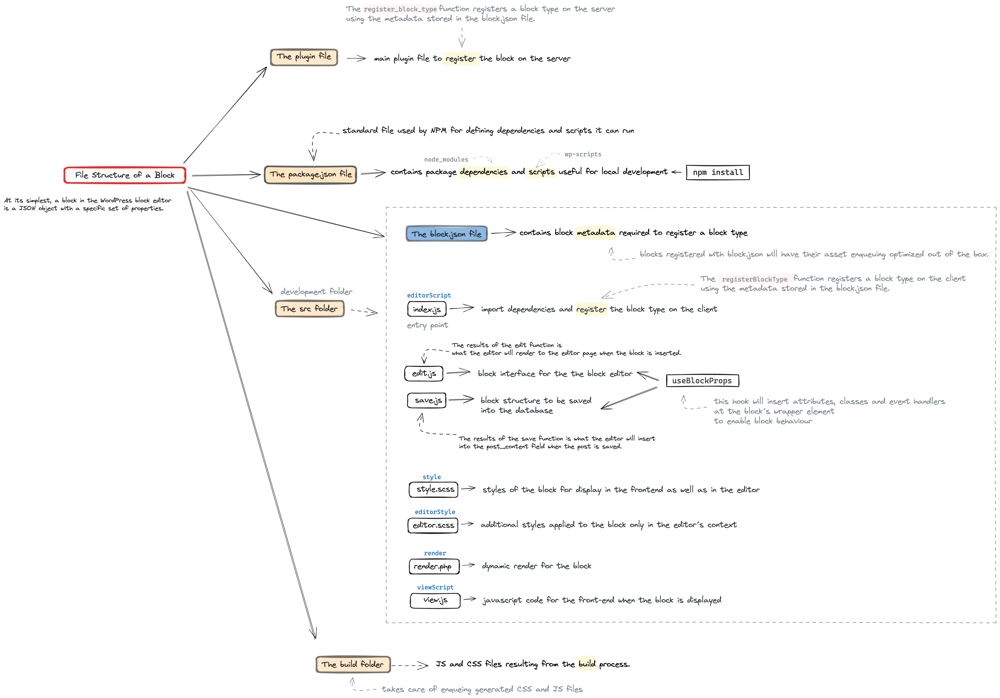

### Overviews:
`wp-env` is the official recommendation by Block-Editor (Gutenberg) Project for setting up dev env

`@wordpress/create-block` package is an officially supported tool to scaffold the structure of files needed to create and register a block. 

`wp-scripts` is for node.js dev server, build setups and maintaining library compatibility. Comes default with `create-block`. 

### When Docker needs `sudo`:
add group `this` and `sudo usermod -aG docker $USER`
then run `npx wp-env start`


If you installed Docker Desktop first, then removed it and installed the Docker Engine, you may need to switch the Docker context with this command: `docker context use default`


### Docker Management Commands:
Show all processes `docker ps`


### `wp-env | @wordpress/env`:
Requires `Docker` to be installed. Then install the wp-env package globally `npm -g install @wordpress/env`

Alternative use `npx` to avoid global installation like `npx wp-env start`. Or use locally by `npm i @wordpress/env --save-dev`.

For local dev dependency, use `npm init` on plugin's directory and install `wp-env` locally.
Also, for block plugin `npx @wordpress/create-block@latest <block-plugin-name>` will create a boilerplate block plugin.

Then navigate to an existing plugin directory, theme directory, or a new working directory in the terminal and run
- `wp-env start` or `npm run start wp-env` and `wp-env stop` to stop

after completion, access the local environment at: http://localhost:8888. Log into the WordPress dashboard using username `admin` and password `password`.

For custom env config use `.wp-env.json`, details on `@wordpress/env package`

To reset and clean the wp database `wp-env clean all`
To remove the local env for a specific project, run `wp-env destroy`
To uninstall wp-env `npm -g uninstall @wordpress/env`

Another way is to use that as Dev dependency `npm i @wordpress/env -D`
Then add scripts `"wp-env":"wp-env"` and run as `npm run wp-env start`

`npx wp-env <cmd>` sometimes requires inclusion of `"wp-env":"wp-env"` in package.json scrips

https://www.npmjs.com/package/@wordpress/env/v/2.0.0#installation-as-a-local-package

### Creation of Custom Block:
Custom blocks for the Block Editor in WordPress are typically registered using plugins. 

To create a block plugin use `npx @wordpress/create-block@latest <block-plugin-name>` command, check/populate `.wp-env.json` for targeted configuration

Then
`npx wp-env start` from `theme` or `plugin` directory
`npx wp-env start` to clean everything `wp-env clean all`
`docker rm -v -f $(docker ps -qa)` // to remove all docker container

Then `npm run start` to start the dev server and hop into localhost:<port>


### `@wordpress/create-block` package:
To scaffold a block plugin with default config
- `npx @wordpress/create-block@latest <custom-name>`

To scaffold with interactive mode
- `npx @wordpress/create-block@latest`

With other options, a dynamic block will be created named "my-plugin"
- `npx @wordpress/create-block@latest --namespace="my-plugin" --slug="my-block" --variant="dynamic"`

External/Local template as npm package can also be used to scaffold
- `npx @wordpress/create-block@latest --template my-template-package`
- `npx @wordpress/create-block@latest --template ./path/to/template-directory`

Docs https://developer.wordpress.org/block-editor/reference-guides/packages/packages-create-block/#template

### `@wordpress/scripts` package: 
This package abstracts away much of the initial setup, configuration, and boilerplate code associated with JavaScript development for modern WordPress.

`wp-scripts` comes automatically when initialized with `create-block`. But to manually setup ensure the directory contains a package.json file, a build folder, and an src folder. The src folder should also include an index.js file.

To setup using npm
- `npm init` a project & set entry point `build/index.js`
- `npm install @wordpress/scripts --save-dev`

Then add scripts to use on dev and build
```json
{
    "scripts": {
        "start": "wp-scripts start",
        "build": "wp-scripts build"
    }
}
```
Upon build a `build/index.asset.php` will also be created for dependencies, version and cache busting.

Docs https://developer.wordpress.org/block-editor/getting-started/devenv/get-started-with-wp-scripts/

### Enqueuing assets | block.json & extra scripts:
If block is registered via `register_block_type` in `<plugin-name>.php` file, the scripts defined in `block.json` will be automatically enqueued

A example `block.json` file, all assets are being enqueued at the bottom

```json
{
  "$schema": "https://schemas.wp.org/trunk/block.json",
  "apiVersion": 3,
  "name": "create-block/todo-list",
  "version": "0.1.0",
  "title": "Todo List",
  "category": "widgets",
  "icon": "smiley",
  "description": "Example block scaffolded with Create Block tool.",
  "example": {},
  "supports": {
    "html": false
  },
  "textdomain": "todo-list",
  "editorScript": "file:./index.js",
  "editorStyle": "file:./index.css",
  "style": "file:./style-index.css",
  "viewScript": "file:./view.js"
}
```

To manually enqueue files in the editor, in any other context, use the `<plugin-name>.php` file, like

```php
/**
 * Enqueue Editor assets.
 */
function example_project_enqueue_editor_assets() {
    $asset_file = include( plugin_dir_path( __FILE__ ) . 'build/index.asset.php');

    wp_enqueue_script(
        'example-editor-scripts',
        plugins_url( 'build/index.js', __FILE__ ),
        $asset_file['dependencies'],
        $asset_file['version']
    );
}
add_action( 'enqueue_block_editor_assets', 'example_project_enqueue_editor_assets' );

```

Docs: https://developer.wordpress.org/block-editor/how-to-guides/enqueueing-assets-in-the-editor/

### Code Quality and Tests:
Use `wp-scripts` to setup linters and test

```json
{
    "scripts": {
        "format": "wp-scripts format",
        "lint:css": "wp-scripts lint-style",
        "lint:js": "wp-scripts lint-js",
        "test:e2e": "wp-scripts test-e2e",
        "test:unit": "wp-scripts test-unit-js"
    }
}
```


### Scaffold a Dynamic Block with `create-block`:
Dynamic block scaffolding is done by specifying `--varian=dynamic`

```sh
npx @wordpress/create-block@latest give-a-name --variant=dynamic
# Then cd into the newly created directory
# add `.wp-env.json` to run a wordpress instance with this plugin
# then install node package and run npx wp-env start
```

### Block's File Structure:
- `./<plugin-file>.php` => entry point to register the block

- `./src/block.json` => entry point block config & binding other scripts

- `./src/index.js` => linked by block.json, main JavaScript file of the block and is used to register it on the client, call `registerBlockType` fn for editor spot and link `edit.js`/`save.js` react component

- `./src/edit.js` => responsible for rendering the block’s editing UI, Settings. It will be imported and used by `registerBlockType` fn

- `./src/save.js` => markup that's gonna be saved into WP DB. This gets passed to the save property of the registerBlockType fn.

- `./src/render.php` => returns servers-side block markup, this file will take precedence over other ways to render the block’s markup on the front end.

- `./src/view.js` => will be loaded in the front end when the block is displayed

- `./src/editor.(css|scss|sass)` => contains the additional styles applied to the block in the Block Editor

- `./src/style.(css|scss|sass)` => loaded in both the Block Editor and on the front end



Docs https://developer.wordpress.org/block-editor/getting-started/fundamentals/file-structure-of-a-block/

### `block.json`notable props:
```json
{
	"$schema": "https://schemas.wp.org/trunk/block.json",
	"apiVersion": 3,
	"name": "create-block/copyright-block-dynamic",
	"version": "0.1.0",
	"title": "Copyright Block Dynamic",
	"category": "widgets",
	"icon": "smiley",
	"description": "Example block scaffolded with Create Block tool.",
	"example": {},
	"supports": {
		"html": false
	},
	"textdomain": "copyright-block-dynamic",
	"editorScript": "file:./index.js",
	"editorStyle": "file:./index.css",
	"style": "file:./style-index.css",
	"render": "file:./render.php",
	"viewScript": "file:./view.js"
}
```

### Block Support | Adding/Removing:
This the `support` prop inside `block.json` is the configuration part for adding and removing customization options for the block in the editor dashboard.

* configuration part for editor support

```json
"supports": {
    "color": {
        "background": false,
        "text": true
    },
    "html": false,
    "typography": {
        "fontSize": true
    }
},
```

Detail Support Property Docs : https://developer.wordpress.org/block-editor/reference-guides/block-api/block-supports/

### index.js's `registerBlockType` function:
it accepts a block's unique name as 1st param (inject form `block.json`) and on optional second param of type `settings?: Partial<BlockConfiguration<TAttributes>>`, an object containing various `React Components`

```jsx
import Edit from './edit'; // a react component
import metadata from './block.json';
const calendarIcon = (
    <svg>
    {/* svg props */}
    </svg>
);

registerBlockType( metadata.name, {
    icon: calendarIcon,
    edit: Edit
} );
```

### `edit.js`:
controls how the block functions and appears in the Editor.
`useBlockProps` returns necessary css classes and styles for block's wrapper in the editor. for render.php its `get_block_wrapper_attributes()` in front-end.

* edit.js
```jsx
const currentYear = new Date().getFullYear().toString();

export default function Edit() {
	return (
		<p { ...useBlockProps() }>
			{ __(
				`©${currentYear} hello from the editor! aka edit.js`,
				'copyright-block-dynamic'
			) }
		</p>
	);
}
```
* render.php
```php
<?php ?>

<p <?php echo get_block_wrapper_attributes(); ?>>
	<?php esc_html_e( '@' . date("Y") . ' render.php!', 'copyright-block-dynamic' ); ?>
</p>
```

Block Wrapper : https://developer.wordpress.org/block-editor/getting-started/fundamentals/block-wrapper/

### `save.js` | returned component is available in `render.php` 's `$content` variable:
The callback functional react component of the `registerBlockType` 's save prop is the actual code thats gonna be saved to the DB. Like edit.js it can take `attributes` prop

Switching the Block Editor View to `code` view will show the output of `save.js`. Where the visual editor view will show the `edit` callback component.

* the `edit'js` is responsible for editor view and can only mutate the attributes which are returned as the `$attributes` variable in `render.php`
* `save.js` is responsible for static content with markup that will be saved all together in the db when the post will be saved. 
```js
import React from 'react'
import { useBlockProps } from '@wordpress/block-editor';

function Save({ attributes }) {
  const { fallbackCurrentYear, showStartingYear, startingYear } = attributes;

  if (!fallbackCurrentYear) {
    return null;
  }

  let displayDate;

  if (showStartingYear && startingYear) {
    displayDate = startingYear + '-' + fallbackCurrentYear;
  } else {
    displayDate = fallbackCurrentYear;
  }

  return (
    <p {...useBlockProps.save()}>© {displayDate}</p>
  );
}

export default Save
```

### Block attributes and exposure in js files:
Attributes are used to store custom data for block’s markup and content.
Block attributes are generally specified in the block.json file, and the editor ui for those attribute values needs to be hooked in `edit.js`

```json
"attributes": {
    "showStartingYear": {
        "type": "boolean"
    },
    "startingYear": {
        "type": "string"
    }
},
```

There are some wp built in components that automatically hooked into dashboard's editor interface, ie, `InspectorControls` form `@wordpress/block-editor`. To read/set/update values on this attributes, the `Edit` function can accept `attribute, setAttribute` as its prop

```js
export default function Edit({attribute, setAttribute}) {
	const { showStartingYear, startingYear } = attribute;
    // ... code
}
```

docs on block attributes https://developer.wordpress.org/block-editor/reference-guides/block-api/block-attributes/

### Block attributes exposer to `render.php`:
These 3 variables will be available in the dynamic php file
`$attributes` (array): The block attributes.
`$content` (string): The block default content.
`$block` (WP_Block): The block instance/object.

```php
// printing those variables to inspect
<?php 
echo "<p>\$attributes:</p> <pre>" . var_export($attributes, true) . "</pre>";
// $content will only populate if there is the save callback of the registerBlockType function
echo "<p>\$content:</p> <pre>" . var_export($content, true) . "</pre>";
echo "<p>\$block:</p> <pre>" . var_export($block, true) . "</pre>"; 
?>
```

### Official available Editor UI Components | `@wordpress/components`:
Get IDE intellisense by installing `npm i @wordpress/components -D`

### Dynamic vs Static vs Hybrid Block:
Dynamic: its block markup and associated attributes are stored into DB but its HTML `output` is not stored, rather rendered dynamically by php `render.php`

Static: store the block markup, attributes, and HTML output in the database. also can be further enhanced dynamically on the front end. For structural changes (removing the block plugin), static block needs a fallback markup so that it will work all on cases. 

Hybrid Block: combination of both dynamic (`render.php`) and static (`save.js`) block

### Interactivity API:
It's kinda `alpine.js` version of wordpress. Added in wp 6.5 as a way to interact with the block (animation, mutation, etc). Only dynamic block's are supported (as it requires `render.php`)

Interactivity API allows to add behaviors to blocks that will happen in response to user interactions. It extends standard HTML with `directives`, which are special `data attributes` (usually inserted into `render.php`) that can listen to and modify the behavior of any DOM element. With directives, you can manipulate the DOM, apply CSS styles, handle user input, and much more.

To enable interactivity api in a block plugin, `block.json` needs
```json
"supports": {
    "interactivity": true
},
```

Docs: https://developer.wordpress.org/block-editor/reference-guides/interactivity-api/
Tutorial: https://developer.wordpress.org/news/2024/04/11/a-first-look-at-the-interactivity-api/


### Steeps to utilize `Interactivity` API:
- Add directives as data attributes to the HTML markup in `render.php` and global state (if any)
- Create a store with the logic (state, actions, or callbacks) needed for interactivity (usually inside `view.js`)
    - actions update the global state or the local context, which, in turn, updates the HTML element connected to either of them.
    - callbacks will run as side effects (not directly invoked by user interaction, rather by state change)
    - state property can be use to define the derived state or context using a getter function

* view.js file
```js
import { store, getContext } from '@wordpress/interactivity';

const { state } = store( 'create-block', {
	state: {
		get themeText() {
			return state.isDark ? state.darkText : state.lightText;
		},
	},
	actions: {
		toggleOpen() {
			const context = getContext();
			context.isOpen = ! context.isOpen;
		},
		toggleTheme() {
			state.isDark = ! state.isDark;
		},
	},
	callbacks: {
		logIsOpen: () => {
			const { isOpen } = getContext();
			// Log the value of `isOpen` each time it changes.
			console.log( `Is open: ${ isOpen }` );
		},
	},
} );
```

* render.php
```php
<?php
// Generates a unique id for aria-controls.
$unique_id = wp_unique_id( 'p-' );

// Adds the global state.
wp_interactivity_state(
	'create-block',
	array(
		'isDark'    => false,
		'darkText'  => esc_html__( 'Switch to Light', 'donation-calculator' ),
		'lightText' => esc_html__( 'Switch to Dark', 'donation-calculator' ),
		'themeText'	=> esc_html__( 'Switch to Dark', 'donation-calculator' ),
	)
);
?>

<div
	<?php echo get_block_wrapper_attributes(); ?>
	data-wp-interactive="create-block"
	<?php echo wp_interactivity_data_wp_context( array( 'isOpen' => false ) ); ?>
	data-wp-watch="callbacks.logIsOpen"
	data-wp-class--dark-theme="state.isDark"
>
	<button
		data-wp-on--click="actions.toggleTheme"
		data-wp-text="state.themeText"
	></button>

	<button
		data-wp-on--click="actions.toggleOpen"
		data-wp-bind--aria-expanded="context.isOpen"
		aria-controls="<?php echo esc_attr( $unique_id ); ?>"
	>
		<?php esc_html_e( 'Toggle', 'donation-calculator' ); ?>
	</button>

	<p
		id="<?php echo esc_attr( $unique_id ); ?>"
		data-wp-bind--hidden="!context.isOpen"
	>
		<?php
			esc_html_e( 'Donation Calculator - hello from an interactive block!', 'donation-calculator' );
		?>
	</p>
</div>
```


### Directives | `data-wp-<name>` | `data-wp-interactive="store-name"`:
All wordpress specific data directive follows `data-wp-directiveName` syntax. 

`data-wp-interactive` directive activates interactivity for the wrapping html tag and its children through the Interactivity API. The first parameter of store function in `view.js` file should match with the data-wp-interactive value.

All directives https://developer.wordpress.org/block-editor/reference-guides/interactivity-api/api-reference/#list-of-directives

### php Directives | Global State & Local Context:
`wp_interactivity_state()` php function is used to store global state. Which are available in the `view.js` file as `state` object.

To store scoped information, `wp_interactivity_data_wp_context()` php function is used, usually in wrapping html element/div, and the stored information will be available through `useContext()` call in `view.js`. The context is local and is available to containing element/div and all its children, but not to other blocks.

### Directives non-php | `data-wp-context` |  `data-wp-on--<event>` | `data-wp-bind--<>`:
context can also be defined as non-php directives like `data-wp-context='{ "foo": "bar" }'`. Behind the scene php's wp_interactivity_data_wp_context() function returns a stringify json object like this. 

```html
<div data-wp-context='{ "foo": "bar" }'>
    <span data-wp-text="context.foo"><!-- Will output: "bar" --></span>

    <div data-wp-context='{ "bar": "baz" }'>
        <span data-wp-text="context.foo"><!-- Will output: "bar" --></span>

        <div data-wp-context='{ "foo": "bob" }'>
            <span data-wp-text="context.foo"><!-- Will output: "bob" --></span>
        </div>
    </div>
</div>
```

`data-wp-on--[event]` is for listing DOM events and firing store's function, ie `data-wp-on--click="actions.toggle"`

`data-wp-bind--[attribute]` allows setting HTML attributes on elements based on a boolean or string value.

```html
<li data-wp-context='{ "isMenuOpen": false }'>
    <button
        data-wp-on--click="actions.toggleMenu"
        data-wp-bind--aria-expanded="context.isMenuOpen"
    >
        Toggle
    </button>
    <div data-wp-bind--hidden="!context.isMenuOpen">
        <span>Title</span>
        <ul>
            SUBMENU ITEMS
        </ul>
    </div>
</li>
```

`data-wp-class--[css-className]` adds or removes a class to an HTML element, depending on a boolean value. ie, 

`data-wp-class--selected="context.isSelected"` will add the class to the html element if `context.isSelected` is true, if not, it will be removed.

`data-wp-style--[css-property]` adds or removes inline style to an HTML element, depending on its boolean value. 
```html
<div data-wp-context='{ "color": "red" }'>
    <button data-wp-on--click="actions.toggleContextColor">
        Toggle Color Text
    </button>
    <p data-wp-style--color="context.color">Hello World!</p>
</div>
>
```

`data-wp-text` sets the inner text of an HTML element

`data-wp-watch` runs a callback when the node is created and runs it again when the state or context changes
```html
<div data-wp-context='{ "counter": 0 }' data-wp-watch="callbacks.logCounter">
    <p>Counter: <span data-wp-text="context.counter"></span></p>
    <button data-wp-on--click="actions.increaseCounter">+</button>
    <button data-wp-on--click="actions.decreaseCounter">-</button>
</div>
```

`data-wp-init` runs a callback only when the node is created `<div data-wp-init="callbacks.logTimeInit">`

`data-wp-run` runs the passed callback during the node’s render execution. Inside `view.js`, hooks like useState, useWatch, or useEffect can be custom composed inside the passed callback. https://developer.wordpress.org/block-editor/reference-guides/interactivity-api/api-reference/#wp-run

`data-wp-key` assigns a unique key to an element to help the Interactivity API identify it when iterating through arrays of elements.

`data-wp-each` directive is intended to render a list of elements

`data-wp-each-child` ensures hydration works as expected for server-side rendered lists.

### Accessing data inside of store's callback | `view.js`:
The store() function can be called multiple times. All store() calls with the same namespace return the same references, i.e., the same state, actions, etc., containing the result of merging all the store parts passed.

```js
store( 'myPlugin', {
    state: {
        someValue: 1,
    },
} );

const { state } = store( 'myPlugin', {
    actions: {
        someAction() {
            state.someValue; // = 1
        },
    },
} );
```

`getContext()` To access the context inside an action, derived state, or side effect
`getElement` To access the reference of the html element

```js
const { state } = store( 'myPlugin', {
    state: {
        get someDerivedValue() {
            const context = getContext();
            const { ref } = getElement();
            // ...
        },
    },
    actions: {
        someAction() {
            const context = getContext();
            const { ref } = getElement();
            // ...
        },
    },
    callbacks: {
        someEffect() {
            const context = getContext();
            const { ref } = getElement();
            // ...
        },
    },
} );
```
Docs https://developer.wordpress.org/block-editor/reference-guides/interactivity-api/api-reference/#accessing-data-in-callbacks

### Questions to solve:
=> How to get all the type information of `registerBlockType` fun
    - possible (https://www.npmjs.com/package/@wordpress/blocks)
    - possible watch interactivity api typescript example
    - possible `@types/wordpress__block-editor` npm package, but find official solution first.
    - also `@wordpress/components` typescript usages https://developer.wordpress.org/block-editor/reference-guides/packages/packages-components/#typescript